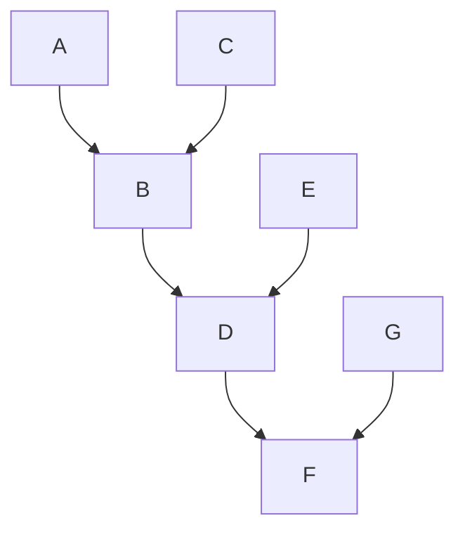

# INTRODUCTION

A lightweight, high-performance C++17 Tensor library with Automatic Differentiation (Autograd) designed for Machine Learning research and compute-efficient operations.

Inspired by Micrograd and PyTorch, this project demonstrates standard C++ abstractions for multi-dimensional array operations, automatic computational graph construction, and backpropagation.

___

# Developing process

## 1. Implementing Tensor computing system which allows to make multiplication and add operations with Tensors

To that part tensor.cpp belongs for the most part

The next math i used to implement all of the methods:
* Matrix Multiplication (Matmul): Given two matrices $A \in \mathbb{R}^{m \times n}$ and $B \in \mathbb{R}^{n \times p}$, their product $C = A \cdot B \in \mathbb{R}^{m \times p}$ is calculated as:

* **Element-wise Addition (and Broadcasting):** For two tensors $A$ and $B$ of matching dimensions ($m \times n$), the sum $C = A + B$ is computed element-by-element:

  $$c_{i,j} = a_{i,j} + b_{i,j}$$
* Element-wise Addition (and Broadcasting):For two tensors $A$ and $B$ of matching dimensions $(m \times n)$, the sum $C = A + B$ is computed element-by-element:$$c_{i,j} = a_{i,j} + b_{i,j}$$
* Hadamard Product (Element-wise Multiplication):For tensors $A, B \in \mathbb{R}^{m \times n}$, element-wise multiplication $C = A \odot B$ is defined as:$$c_{i,j} = a_{i,j} \cdot b_{i,j}$$
* Scalar Multiplication:Multiplying a tensor $A \in \mathbb{R}^{m \times n}$ by a scalar $\alpha \in \mathbb{R}$:$$c_{i,j} = \alpha \cdot a_{i,j}$$

> Operations of matrix multiplication work, no matter is the order of their dimensions is correct.

## 2. Implementing computing graph which will allow me to compute gradient after using backward method

I can assume that Merge blocks were obtained by multiplying the previous 2 blocks or adding one block to another. So after receiving such a computing tree, I can memorize results that were received and compute the derivative at every step.

## 3. Backward Classes

Backward classes should memorize blocks that were used to compute the result of an operation and update gradients when the backward pass is applied. So every operation should record two states: Tensor result and grad_fn result, which will be sent to the previous level to compute gradients there.

## 4. Modules

This is the core Module base class from which every specific layer and network abstraction inherits. The main idea behind writing this abstract class is parameter management and serialization. I want to automatically track and save the weights of every submodule, allowing me to save the full state of the model to disk. Later, I can restore all trained weights to run inference, resume training, or reuse pre-trained modules across different tasks without re-initializing the parameters.

## 5. Data serialization

Model weights are serialized and saved as binary .bin files. This binary format records parameter names, shape metadata, and raw tensor bytes in a compact form. Storing weights in byte format ensures fast I/O operations and low memory overhead, making it easy to restore the exact state of trained modules for inference or resuming training.

## 6. Bindings

Inspired by PyTorch's architecture, I decided to add Python bindings so the library could be used seamlessly within a Python environment. By binding core C++ classes and methods via pybind11, I enabled writing complete training scripts and neural network models entirely in Python. The primary challenge I faced while developing these bindings was handling C++ iterators for data loading. To resolve this, I implemented custom Python iterator bindings (py::make_iterator / py::iterator) wrapping the nested DataLoader::Iterator class.

___

# Testing

After training the model, I tested it on inference with a test set of 10,000 samples and achieved 93.24% accuracy.

